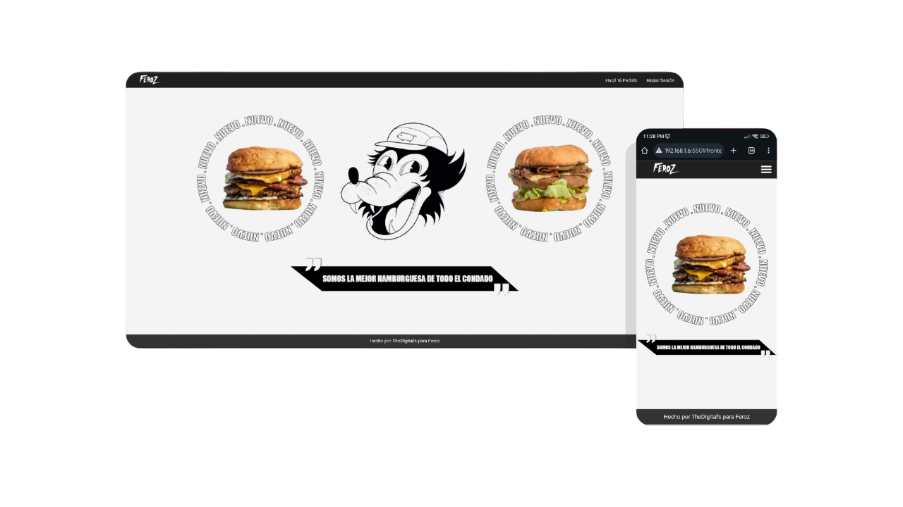
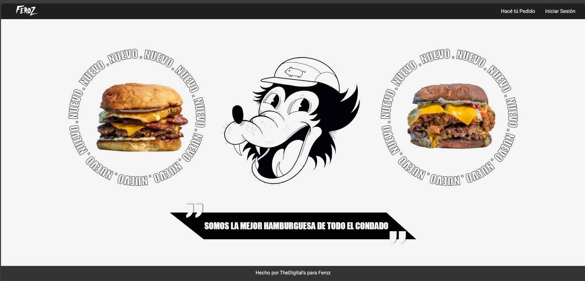
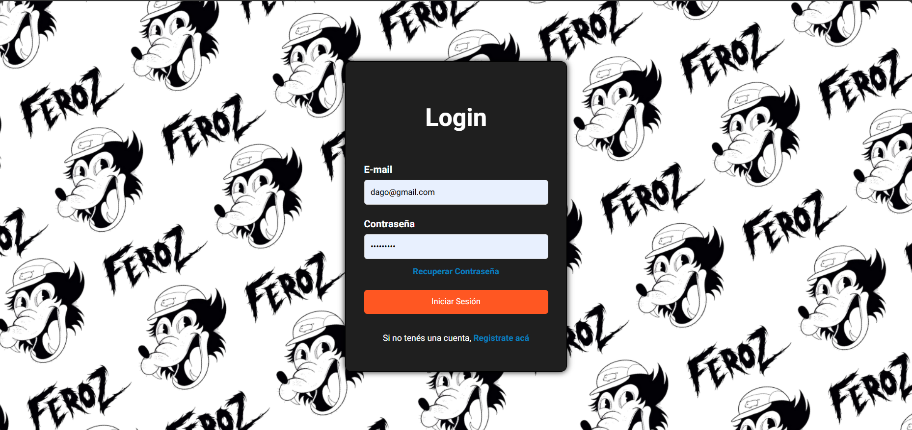
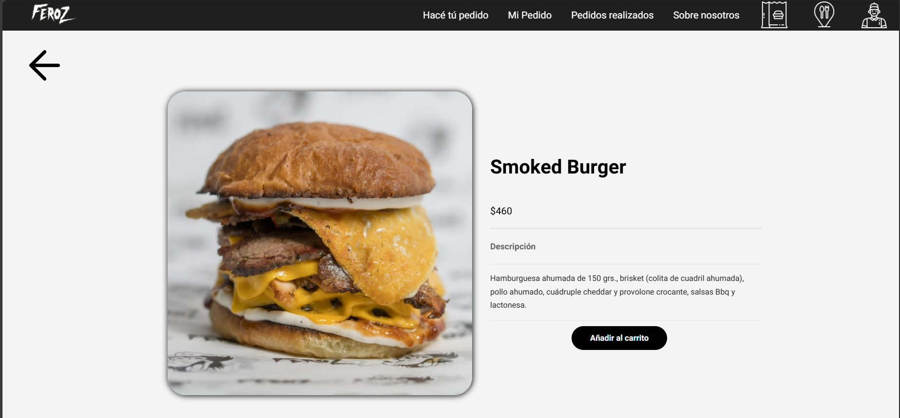

# E-commerce - Feroz

El e-commerce realizado para la hambuerguesería Feroz. El sistema permite tanto gestionar pedidos y productos para el administrador como ver los productos y realizar pedidos para los clientes.

### Pre-requisitos 📋

Pra instalar el software basta con instalar el repositorio y la base de datos. La base de datos tiene que llevar el nombre de feroz.

**Para Clonar el Repositorio:**

`https://github.com/sebass41/TheDigitals.git`

## Construido con 🛠️

* HTML5
* JavaScript
* CSS
* PHP
* MySQL

## Vista de la Página 💥

* Pantalla de Inicio

* Login

* Detalle de Producto

## Autores✒️

* Sebastián Suárez - Desarrollo del backend
* Valentino Modernell - Ayuda con pruebas utilizando Postman
* Felipe Alvarez - Desarrollo del frontend
* Santiago Bogliacino - Desarrollo del frontend

## Agradecimientos 🎉

* Agradecemos a todos los profesores que a lo largo de los 3 años del Bachillerato de Informática nos brindaron todo su apoyo y conocimiento.
* Especial agredecimineto a Mariano Bastarreix y Alexis Aquino por su invaluable ayuda ante las dudas que surgian durante el desarrollo.
* A nuestros amigos y familiares por su paciencia y apoyo constante.

¡Muchas gracias a todos!
